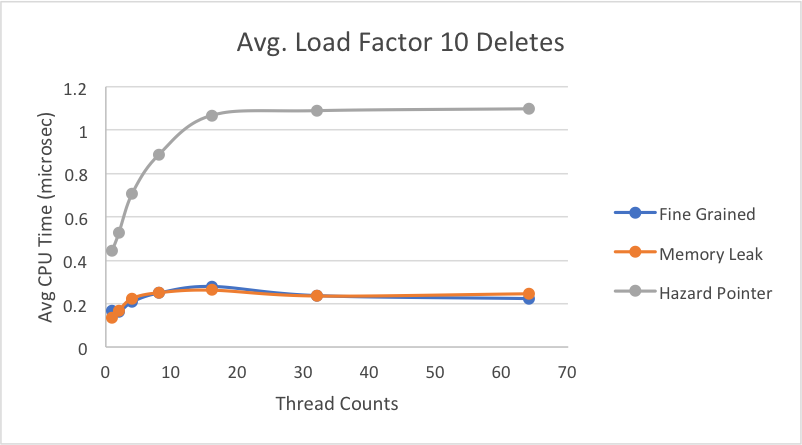
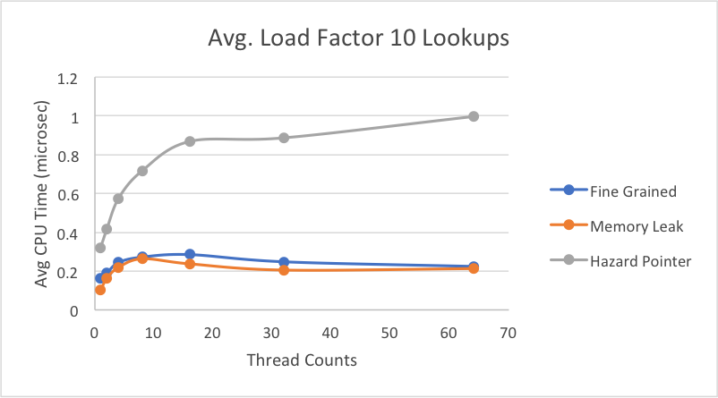
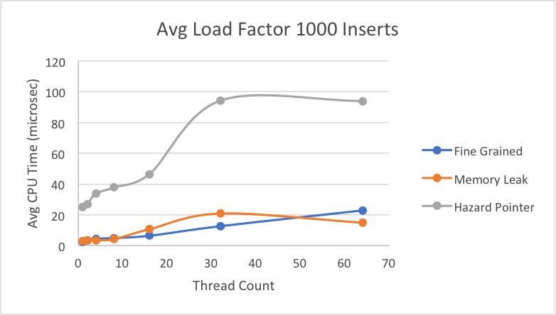
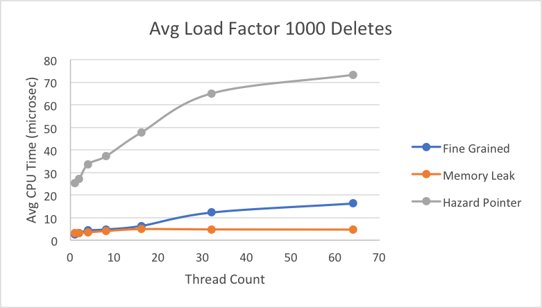
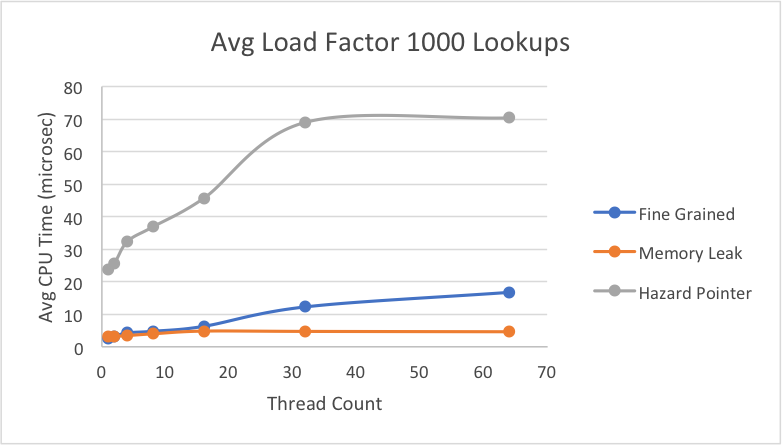
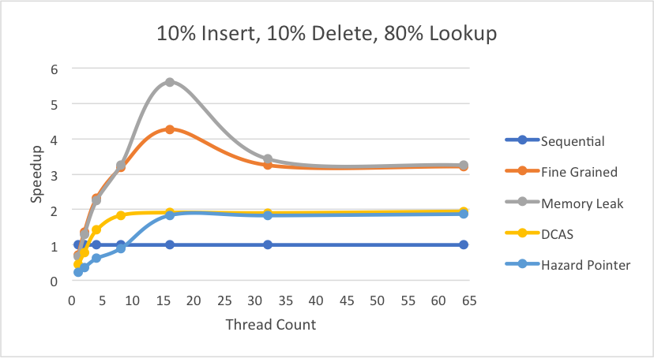

# Final Writeup: Lock-Free Hash Table Implementations
## Brenda Thayillam & Emily Tsui

---

### [Proposal](https://emilytsui.github.io/ParaHash) | [Checkpoint](https://emilytsui.github.io/ParaHash/checkpoint) | [Final Writeup](https://emilytsui.github.io/ParaHash/final)

---

### Summary
For benchmarks, we implemented a sequential hash table to be run on only one thread and a fine-grained lock hash table that locks on each bucket. For our lock-free implementations, the first version we implemented has no memory management and allows for memory leaks to get around the ABA problem, which we based off [this research paper](http://www.research.ibm.com/people/m/michael/spaa-2002.pdf). We also implemented a version that uses the concept of a double CAS with a version tag, but since a double CAS is not available on the 64-bit machine, we used normal CAS and compiled our code for an x86 machine so that a pointer is 4 bytes. Our final implementation is compatible with hazard pointers provided by the [libcds](https://github.com/khizmax/libcds) library. Each of the graphs shown below displays results from runs made on the GHC machines.

### Background
The key data structures in our project are a linked list node and a hash table. We have specialized linked list nodes for each of our implementation with some minor modifications (additional fields, etc). The key operations on are insert, lookup and delete on the hash tables. Inputs to these hash table operations are key-value pairs and outputs are boolean values indicating success or failure of the operation. Under high contention, a lock-based implementation would prevent multiple threads from making progress simultaneously; thus, with a lock-free approach high contention tasks should be able to complete quicker, as at least some operation is guaranteed to make progress.

Additionally, we had to work with data structures that contained hazard pointers for one of our lock-free hash table implementations.

As seen above, we used a global GuardArray from the [libcds](https://github.com/khizmax/libcds) library to "guard" our pointers when threads were still pointing to them, allocating 3 hazard pointer slots for each thread. Additionally, the libary provided us with the capability to "retire" pointers, indicating that they are to be deleted when they are no longer pointed to by other threads (i.e. they are no longer hazard pointers). By taking the set difference of the hazard pointer GuardArray and the retire array, the internals of the [libcds](https://github.com/khizmax/libcds) library freed nodes that were available to be freed.

### Approach
Our lock-free hash tables were implemented for the GHC machines. The main, initial lock-free algorithm that we implemented involved a hash table with sorted keys in its chains and a two-step deletion process. All three operations (insert, lookup, and delete) depend on one integral function – internal find. When nodes are inserted, internal find finds the node with the key being inserted or the next smallest and next largest values. Then, the new node is inserted using a CAS to set the next pointer. For lookups, the algorithm simply returned the output of internal find. For deletes, when a node to be deleted was found, it would be marked by setting a bit on the next pointer using a CAS operation and then the node would attempt to be removed from the corresponding hash table chain using another CAS operation. If this remove CAS failed, then some other thread already removed the current node and thus to remove the node that was to be removed by the other thread, the delete calls internal find. All three of these operations spin until successful completion. Within internal find, we check for marked nodes. Marked nodes indicate nodes that were meant to be deleted but haven’t yet been and thus internal find uses another CAS to delete the appropriate node.

With the x86 CAS implementation, all the CAS operations were performed with the next pointers and the tag of the current node. This implementation compiled specifically for x86 in order to allow multiple-element CAS operations, used the std::atomic::compare_exchange_weak in place of the gcc primitive compare and swap.

The hazard pointer implementation uses the libcds library. Each node that is deleted using the delete or internal find operation is sent to the retire list. When the retire list becomes sufficiently large, a set difference is performed between the retire list and the guard array containing hazard pointers. This set of nodes is then safely freed from memory.

All of these implementation were evaluated for performance using up to 16 threads as supported by the GHC machines’ hardware execution contexts (8 hyperthreaded cores) but then were scaled to more threads to understand the effects of thread scheduling in each implementation. Each of the threads was given a chunk of the instructions to execute where instructions were generated randomly with preset probability distributions of each operation. The instructions were stored in a vector and thus, interleaved execution of the instructions created false sharing as the various threads shared the same contiguous elements of the instruction array.

After all these modifications, we analyzed various dimensions of performance between the different implementations including how they compare to the sequential implementation, how they scale with various load factors, the resulting average CPU clock time per instruction, and the resulting average CPU clock time across all operations.

Our test files were created to reflect real-world applications of lock free hash tables that we found included mostly inserts and lookups. Thus, we randomly generated our test files according to a predefined probability distribution (fixed percentage of deletes and the rest distributed evenly across inserts and deletes). This probability distribution approach was modified as necessary to further randomly generate test files according to the research paper we followed. For our tests that analyzed various load factors, we took the overall number of inserts and by the fact that the keys and values were randomly generated, assumed that these key-value pairs were uniformly distributed across the available buckets and thus used load factor = inserts / num_buckets.

### Challenges
The ABA problem is a major challenge for lock-free data structures, so our implementations address it in different ways. Since lock free hash tables compare and swap at the node level, the ABA problem exists with the state of the node seeming to be the same based on address when it is in fact not in the same state. The most basic way to combat the ABA problem was to not free nodes after deleting them, ensuring that the same address couldn't be reused. We had to combine this ABA prevention scheme with a two-step deletion process required for hash table operations that prevented corruption of the overall structure. The two step deletion involved marking each node to be deleted followed by actually deleting the node form the hash table. Thus, even after addressing the ABA problem in this manner, we ran into some difficulties with marking the `next` pointer of each node; the `next` pointer of a node is marked if the node is about to be deleted, but of course when comparing pointers, we had to unmark the nodes and keep track of where we were marking and unmarking, which caused a lot of correctness problems. After getting the memory leak version of the lock-free hash table working, the hazard pointer implementation involved understanding the library source code to figure out how to integrate hazard pointers into our code.

One of our memory managing hash table implementations that also prevented the ABA problem used the double-compare-and-swap operation on nodes with version tags. In order to get this version working properly, we had to create an effective way of blocking the next pointer and the tag together in memory in order to perform an x86 CAS operation on the entire chunk of data. We further had to get it compiled to x86 in order to even make the multiple-element CAS feasible. This implementation caused difficulties because it still used the two-step deletion process and thus needed to be able to modify the next and tag values individually in addition to together as one atomic value with the x86 CAS operation. Realizing that the gcc compare-and-swap primitive only accepted long long values, we resorted to using std::atomic::compare_exchange_weak which resulted in a lot of experimentation with the various memory synchronization methods in order to find the optimal. Even the sequential implementation on x86 was found to have worse performance than on 64-bit and thus we had to ensure that all performance tests performed with the x86 CAS implementation were separate and involved measures relative to other x86 benchmarks.

### Results
Since we based our lock-free solution off [this research paper](http://www.research.ibm.com/people/m/michael/spaa-2002.pdf), we wanted to replicate the graphs they provided to see if our implementation achieved the same or better results. We tested on a test file of similar load as the one they tested on - with 1,000,000 operations, we had 10% deletes, 10% inserts, and 80% lookups. Below, we have comparisons of the graphs of our results on the left to the graphs provided by the research paper on the right. It should be noted that in the research paper, which was published in 2002, their graphs were of results from running code on a 4-core IBM machine. Our code was run on a 8-core hyperthreaded GHC machine, which would be much faster than the machine they ran it on. The graphs show the average CPU time (microseconds/operation) on increasing thread counts.

As shown, all our implementations' average CPU time tend to increase as more threads perform operations simultaneously, even though the load factors are relatively small. We believe this to be as a result of the random generation of our test files. While we calculated the right percentage of inserts to get the average load factor we wanted, we used a random number generator when inserting keys into the hash table, so there is a very good possibility that the keys are not actually distributed evenly. The general trend is that our memory leak implementation performs better than the lock-based implementation for each of the different load factors. This is a result of the lock-based implementation having to lock the bucket even on lookup to ensure that no other thread removes a node while someone else is iterating in a situation of high contention, while the lock-free implementation does not have this problem because of its non-blocking characterstic.

However, our hazard pointer implementation takes consistently longer to perform operations for each of the different load factors, and this has to do with the extra overhead it needs to assign pointers to the guard array to ensure they are protected until they are no longer pointed to. The extra overhead for library function calls when assigning pointers to the guard array and retiring pointers to the retire array likely caused a slowdown. Additionally, hazard pointers implementations naturally have the additional step of performing a set difference between the retire array and guard array to determine which pointers are allowed to be freed. Since we were restricted by the library from assigning an additional thread to do this scanning, a working thread would have to perform this work every time its thread-local retire array filled up, slowing down the average CPU time.

It did not make sense to compare our x86 CAS implementation with these other implementations because thaat implementation was built for an x86 machine, meaning the absolute time it took per operation was significantly slower than our other implementations run on a 64-bit machine.

 

This graph shows our results for an average load factor of 1 on a file with 10% deletes, 10% inserts, and 80% lookups.

 

This graph shows our results for an average load factor of 5 on a file with 10% deletes, 10% inserts, and 80% lookups.

 

This graph shows our results for an average load factor of 10 on a file with 10% deletes, 10% inserts, and 80% lookups.

While the research paper only displayed their results with average CPU time of all operations, we were interested in breaking it down more to determine which specific operations (insert, delete, lookup) took the most time. Thus, we took the average time in microseconds for each individual operations, using an average load factor of 10 on the same file as above with 10% deletes, 10% inserts, and 80% lookups. Here, we decided to scale up to 64 threads to see the behavior of the lock-based implementation when we have more threads than execution contexts. Later, we will see a graph when the load factor is much larger, emphasizing the fact that when a thread for the lock-based implementation is switched out yet holds a lock, it slows down the average time per each operation.

Interestingly, while the hazard pointer performed consistently worse for the average CPU times above, when we break down the average time per insert, the hazard pointer implementation is faster on average for inserts than both the lock-free memory leak version and the fine-grain lock hash table.

Here, we see what we expect to see where the time per delete for the hazard pointer implementation is much slower than for the other two hash table implementations. With the overhead of assigning to a guard array, as well as each thread performing a set difference when its retire array fills up, this slower operation time is to be expected. There seems to be minimal difference between the operation times for the memory leak and fine-grain implementations. This is likely because the load factor is small enough that there still isn't much contention simultaneously for the same buckets. Thus, the fine-grained implementation stil performs relatively well for deletes.

For lookup, we see similar results as we did in deletes with a small improvement in the hazard pointer case, likely due to the overhead during deleting of having to perform a set difference for the retire array. It may seem odd that lookups are only slightly faster than deletes, but in our implementation, every time we iterate through a linked list, we attempt to delete or retire any marked nodes that have been marked from a call to delete. Thus, it's natural that some calls to lookup will also incur the work of having to perform a set difference for retiring nodes.

Next we decided to greatly increase the load factor, while still looking at the breakdowns of average time per individual operation. Overall, we can see more clearly when the lock-free memory leak implementation would be greatly preferred over the fine-grain lock implementation. On average under really high contention, the fine-grain lock can take up to 3x more time than memory leak implementation when performing a delete or lookup. As has been the general trend, hazard pointer takes longer on average for each of the individual operations, likely due to its additional overhead of protecting pointers and retiring them. Across insert, delete, and lookup, fine-grain speedup is consistent and at the same scale, which we expect because for each operation, it goes through the same motion of obtaining a lock for the bucket and performing the operation. Thus, there wouldn't be much variation among the three operations. Hazard pointer and memory leak implementations take slightly longer on average (relative to their own times) to insert than to delete or lookup.

The way our lock-free implementations work, is that when calling insert, we iterate through the linked list associated with the right bucket until we reach the correct place in the sorted list. However, if we find that something has been modified when using CAS, then we restart at the beginning of the linked list and have to reiterate through the whole list in the case that we are holding onto a node that has been deleted. For delete, we only modify the marking of a pointer and expect the node to be deleted the next time it's iterated over, so we have no need to keep iterating until the node is actually deleted. Lookup also only has to iterate through the linked list once. Thus, as seen in the graph above, both hazard pointer and memory leak implementations are generally slower on insert than the other operations and even compared to the fine-grain implementation.

For the delete operation graph above and the lookup operation graph below, we see what we would expect to see, with the hazard pointer doing pretty badly relative to the other two implementations because of its extra overheads to ensure nodes are not freed until they can be.

The lookup times are very similar to the delete operation times, which was also expanded on in the graphs above with load factor 10.

Next, we decided to look at speedups obtained when looking at the time it took to complete all operations in a test file as load factors increased. For each implementation, we compared the total time it took to complete the operations on 16 threads to the time it took for the single-threaded sequential hash table to complete the operations. For our x86 CAS implementation, we compared that to our sequential hash table built for an x86 machine to get an accurate relative speedup.

As expected, the memory leak implementation is scaling well in relation to increased load factor because even in growing contention for the buckets, multiple threads can still make progress simultaneously. However, we see that the fine-grain lock implementation is getting approximately exponentially slower, which is what we expect because when there is higher contention for the buckets, still only one thread can hold the bucket's lock at a time. The hazard pointer implementation is actually getting slower with more threads, and we believe this to be because of false sharing with the guard array that holds the hazard pointers. While each thread has its own slots in the guard array, the whole array is still global, meaning multiple threads from different cores trying to access it will cause false sharing. The x86 CAS implementation is steadily increasing as load factors increase, but it is overall slower than the other implementations because of the overhead of memory synchronization. To utilize the CAS for x86, we needed to create an atomic struct to block together the two pointers we needed to compare.

Under the same workload, we observe the following performances:

As evident, both the fine grained and memory leak implementations see great speedups up to 16 threads indicative of the instructions that are executed simultaneously by the multiple threads. Moreover, the memory leak implementation’s speedup in this region is larger than the fine grained lock version due to the ability to execute multiple instructions on the same hash bucket at the same time. Beyond 16 threads, both the fine grained and memory leak implementations see a decrease in speedup since 16 threads is the maximum hardware execution contexts available on the 8 core hyperthreaded GHC machines. However, the memory leak implementation maintains an upper hand when scaled beyond 16 threads because the thread with the lock in the fine grained implementation being scheduled out would mean that no progress can be made on that bucket when this is not an issue in the fine grained. Both the “DCAS” x86 and the hazard pointer implementations show promise in scaling beyond 16 threads by maintaining the same high speedup although this speedup is low relative to fine grained and memory leak due to memory management overhead.

Scaling this performance to real-world applications where inserts and lookups are the most frequent with a much smaller percentage of deletes (10% deletes, 45% inserts, 45% lookups), we see the following results:

It is evident that this workload also achieves all the same great features obtained in the previous test setting.

Although the “DCAS” x86 and hazard pointer implementations suffered from memory management overhead in the previous cases, there are instances where these implementations scale better than the fine grained and memory leak implementations.

As seen in the above graph, under a workload with uniform percentages of inserts, lookup, and deletes both the hazard pointer implementation and the x86 CAS implementation scale with larger thread counts. The “DCAS” x86 implementation scales so well that it performs even better than the fine grained and memory leak implementations that performed better in most of the other cases.

So, the overall decision on lock-free vs. fine-grained and if lock-free which implementation comes down to two major factors: workload characteristics and memory management scheme (dynamic vs. bulk frees)

### References
- Maged M. Michael. High Performance Dynamic Lock-Free Hash Tables and List-Based Sets. http://www.research.ibm.com/people/m/michael/spaa-2002.pdf
- `libcds` Library. https://github.com/khizmax/libcds / http://libcds.sourceforge.net/doc/cds-api/index.html

Equal work was performed by both project members.
