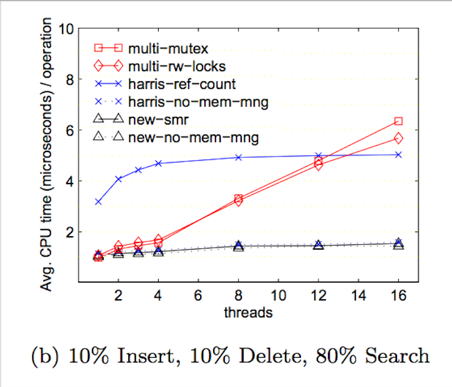

# Final Writeup: Lock-Free Hash Table Implementations
## Brenda Thayillam & Emily Tsui

---

### [Proposal](https://emilytsui.github.io/ParaHash) | [Checkpoint](https://emilytsui.github.io/ParaHash/checkpoint) | [Final Writeup](https://emilytsui.github.io/ParaHash/final)

---

### Summary
For benchmarks, we implemented a sequential hash table to be run on only one thread and a fine-grained lock hash table that locks on each bucket. For our lock-free implementations, the first version we implemented has no memory management and allows for memory leaks to get around the ABA problem, which we based off [this research paper](http://www.research.ibm.com/people/m/michael/spaa-2002.pdf). We also implemented a version that uses the concept of a double CAS with a version tag, but since a double CAS is not available on the 64-bit machine, we used normal CAS and compiled our code for an x86 machine so that a pointer is 4 bytes. Our final implementation is compatible with hazard pointers provided by the [libcds](https://github.com/khizmax/libcds) library.

### Background
The key data structures in our project are a linked list node and a hash table. We have specialized linked list nodes for each of our implementation with some minor modifications (additional fields, etc). The key operations on are insert, lookup and delete on the hash tables. Inputs to these hash table operations are key-value pairs and outputs are boolean values indicating success or failure of the operation. Under high contention, a lock-based implementation would prevent multiple threads from making progress simultaneously; thus, with a lock-free approach high contention tasks should be able to complete quicker, as at least some operation is guaranteed to make progress.

Additionally, we had to work with data structures that contained hazard pointers for one of our lock-free hash table implementations.

As seen above, we used a global GuardArray from the [libcds](https://github.com/khizmax/libcds) library to "guard" our pointers when threads were still pointing to them. Additionally, the libary provided us with the capability to "retire" pointers, indicating that they are to be deleted when they are no longer pointed to by other threads (i.e. they are no longer hazard pointers). By taking the set difference of the hazard pointer GuardArray and the retire array, the internals of the [libcds](https://github.com/khizmax/libcds) library freed nodes that were available to be freed.

### Challenges
The ABA problem is a major challenge for lock-free data structures, so our implementations address it in different ways. Since lock free hash tables compare and swap at the node level, the ABA problem exists with the state of the node seeming to be the same based on address when it is in fact not in the same state. The most basic way to combat the ABA problem was to not free nodes after deleting them, ensuring that the same address couldn't be reused. We had to combine this ABA prevention scheme with a two-step deletion process required for hash table operations that prevented corruption of the overall structure. The two step deletion involved marking each node to be deleted followed by actually deleting the node form the hash table. Thus, even after addressing the ABA problem in this manner, we ran into some difficulties with marking the `next` pointer of each node; the `next` pointer of a node is marked if the node is about to be deleted, but of course when comparing pointers, we had to unmark the nodes and keep track of where we were marking and unmarking, which caused a lot of correctness problems. After getting the memory leak version of the lock-free hash table working, the hazard pointer implementation involved understanding the library source code to figure out how to integrate hazard pointers into our code.

One of our memory managing hash table implementations that also prevented the ABA problem used the double-compare-and-swap operation on nodes with version tags. In order to get this version working properly, we had to create an effective way of blocking the next pointer and the tag together in memory in order to perform a DCAS operation on the entire chunk of data. We further had to get it compiled to x86 in order to even make the DCAS feasible. This implementation caused difficulties because it still used the two-step deletion process and thus needed to be able to modify the next and tag values individually in addition to together with the DCAS operation. Realizing that the gcc compare-and-swap primitive only accepted long long values, we resorted to using std::atomic::compare_exchange_weak which resulted in a lot of experimentation with the various memory synchronization methods in order to find the optimal. Even the sequential implementation on x86 was found to have worse performance than on 64-bit and thus we had to ensure that all performance tests performed with the DCAS implementation were separate and involved measures relative to other x86 benchmarks.

### Results
Since we based our lock-free solution off [this research paper](http://www.research.ibm.com/people/m/michael/spaa-2002.pdf), we wanted to replicate the graphs they provided to see if our implementation achieved the same or better results.
 
 
 

### Preliminary Results
We found in our preliminary research that inserts and deletes are the most commonly performed operations. Thus for our tests with various percentages of deletes and inserts & lookups happening with the same likelihood, our results were:

In all three of these plots, the fine grained and memory leak version peak at 16 threads because that is the total number of available execution contexts on the GHC machines. Then for more threads beyond this point, the memory leak lock free version performs slightly better than the fine grained version because for the locking version if the thread holding the bucket's lock gets scheduled out then no progress can be made on operations on that bucket. Although the DCAS and hazard pointer had less overall speedup due to the overhead of memory management, the above results clearly show that these results scale better with more threads. 

Then evaluated on a workload with an uniform amount of all three operations, we achieved:

This plot clearly indicates that in the the uniform case, DCAS and hazard pointers scale well and perform better than the fine grained and memory leak versions at higher thread counts.

To further explore the effects of the load factor on the performance, we found:

In this plot it is evident that both the fine grained and memory leak version indicate a general increase in speedup with a larger load factor although the memory leak version has a greater speedup (due to allowing multiple operations on the same bucket simultaneously). The DCAS performance stays relatively the same while the hazard pointer implementation gets worse with larger load factors.
